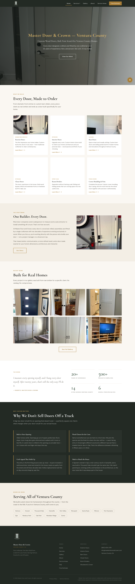
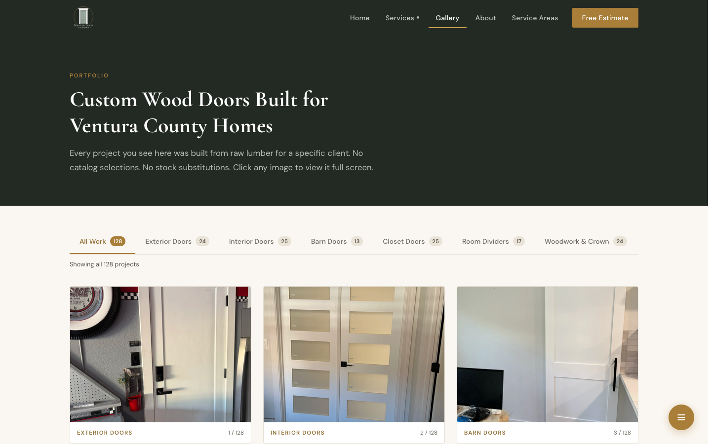

# Master Door and Crown

Marketing website for [Master Door and Crown](https://masterdoorandcrown.com) — a
custom wood door and trim craftsman serving Ventura County, CA. Every door is
designed, built, and installed by one craftsman, and the site is built to match:
no framework, no build step, just fast static pages.



## Stack

- **Plain HTML + CSS + vanilla JS** — no build step, no dependencies
- **Cloudflare Pages** — deploys automatically from `main`
- **Cloudflare R2** — hosts all photography (WebP only) at `images.masterdoorandcrown.com`
- **web3forms** — powers the free-estimate contact form

## Design system

The palette is drawn from the brand logo (sage-green door, gold ring, cream field):

| Token | Value | Use |
|---|---|---|
| `--color-bg` | `#FAF7F2` | Warm cream page background |
| `--color-surface` | `#FFFFFF` | Cards and panels |
| `--color-text` | `#2B2B28` | Warm charcoal body text |
| `--color-wood` / `--color-gold` | `#A87E38` | Gold accent (logo ring) |
| `--color-sage` / `--color-sage-dark` | `#7E9084` / `#5F7365` | Sage green (logo door) |
| `--color-dark` | `#232A24` | Deep green: header, footer, accent bands |

Fonts: **Cormorant Garamond** (headings) and **DM Sans** (body), via Google Fonts.
All tokens live at the top of `css/styles.css`.

## Pages

| Path | Purpose |
|---|---|
| `/` | Homepage — hero, six service tiles, gallery preview, stats |
| `/services` | All six services in detail, with live R2 photo grids |
| `/services/*` | Individual service pages (6) |
| `/gallery` | Filterable 128-photo portfolio with lightbox (filter, swipe, keyboard nav) |
| `/about` | Craftsman story, process, client reviews |
| `/service-areas` + `/cities/*` | County hub and 14 city pages |
| `/contact` | Free-estimate form |
| `/faq` | 10-question accordion with FAQPage structured data |
| `/old-home` | Archived pre-redesign homepage (noindex, kept for reference) |

The `areas/*` files are legacy duplicates of `cities/*`; `_redirects` 301s them
and they are intentionally left in place so no indexed URL ever breaks.

## Gallery photos



Photos live in R2 under one folder per category (`entry-doors`, `interior-doors`,
`barn-sliding-doors`, `closet-doors`, `room-dividers`, `crown-woodwork`), named
`1.webp`, `2.webp`, … sequentially.

Image counts are hardcoded in three places and must be kept in sync with R2:
`index.html`, `services.html`, and `gallery.html` (search for `IMAGE_COUNTS`).

Shell scripts for managing R2 images (all read credentials from `secrets/`):
`upload-images.sh`, `remove-image.sh`, `fix-orientation.sh`, `rename-r2-folders.sh`.
⚠️ `upload-images.sh` and `remove-image.sh` still reference pre-rename folder
names — check against `fix-orientation.sh` (current) before using them.

## Development

```sh
# Serve locally
python3 -m http.server 8765

# Deploy = push to main; Cloudflare Pages picks it up automatically
git push origin main
```

Secrets (R2 keys, API tokens) live in `secrets/credentials.json`, which is
gitignored and must never be committed. See `CLAUDE.md` for the rules.
